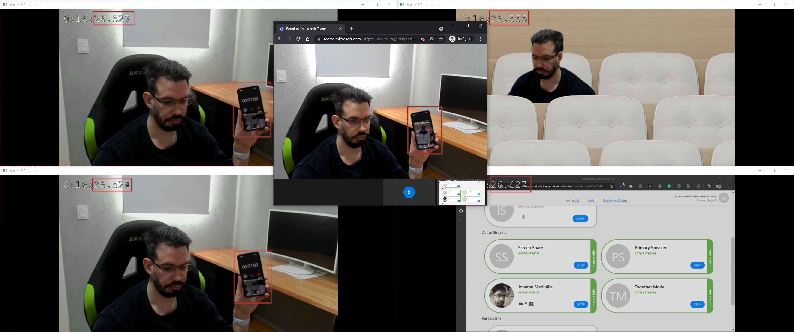

# Media synchronization

## Getting Started

The GStreamer pipelines (where BDK relies on to extract the participants' camera feed) share the same internal clock and base time in order to keep synchronized. This base time is set with the current system time of the first extraction and then is shared with the next extractions.

In this document we will explain how we tested the synchronization between different streams, some expected results, and findings.

## Setup
To play the streams and compare their running times, we used _gst-play_ (one instance per stream) and OBS Studio as main tools.

To run those tools, we used a PC with the following characteristics:

* i7 8700 non-k (6 cores - 12 threads)
* 16 Gb of RAM
* RTX 2080 8 GB VRAM (to take advantage of hardware decoding through GPU)

To run BDK and extract 4 participants at the same time, we used an Azure virtual machine with the *Standard F16s_v2* sku (16 vCPUs, 32 Gb of RAM)

## Tests

To perform the tests, we've invited the BDK bot into a Microsoft Teams meeting, configured the default SRT latency for all extractions, and started the extraction of:
* Dominant Speaker
* Participant
* Together Mode (the user must enable it inside the meeting)
* Screen Share (the user must share his screen)

To set default latency, we did a ping to the BDK host server, took the average RTT (216ms in our case) and followed this [guide](https://www.haivision.com/blog/all/how-to-configure-srt-settings-video-encoder-optimal-performance/) to calculate SRT latency.

**SRT Latency = RTT multiplier * RTT**

Because we don't have a tool to calculate the bandwidth overhead needed to pick the RTT multiplier, we used the highest RTT multiplier from the guide and calculated a latency of 1296ms (6 * 216ms).

### Gst-play

{{PENDING}}

To test the synchronization between the four streams, we opened four terminals and ran _gst-play_ with the SRT url of each stream provided by BDK (check participant card)

**Example of command**
```
gst-play "srt://dev.teamst.co:8888?mode=caller&latency=1296"
```

We left the players running for 45 minutes aproximately and took screenshots at different time to compare the difference in miliseconds between the streams.

**First Screenshot (beginning of the stream)**

| Stream | Running Time|
| ------------- | ------------- |
| Participant (top-left) | 0:09:51.165 |
| Dominant Speaker (bottom-left) | 0:09:51.163 |
| Together Mode (top-right) | 0:09:51.160 |
| Screenshare (bottom-right) | 0:09:51.032 |

||
|:--:|
|*First screenshot*|

**Second Screenshot (7 minutes after the beggining of the stream)**

| Stream | Running Time|
| ------------- | ------------- |
| Participant (top-left) | 0:16:26.527 |
| Dominant Speaker (bottom-left) | 0:16:26.524 |
| Together Mode (top-right) | 0:16:26.555   |
| Screenshare (bottom-right) | 0:16:26.427  |

||
|:--:|
|*Second screenshot*|

**Third Screenshot (47 minutes after the beggining of the stream)**

| Stream | Running Time|
| ------------- | ------------- |
| Participant (top-left) | 0:56:39.637 |
| Dominant Speaker (bottom-left) | 0:56:39.635 |
| Together Mode (top-right) | 0:56:39.666   |
| Screenshare (bottom-right) | 0:56:39.571 |

||
|:--:|
|*Third screenshot*|

As we can see in the three stages of the test run, the maximum difference between all the streams was 119 ms average, and always was betweem the screenshare and one of the other streams. Excepting the screenshare stream, the difference was 23 ms average.

Also, if we compare in all the screenshots the difference between the stopwatch on the Microsoft Teams feed and one of the streams, the difference is constant (3.7 seconds approximately)

| Stage | MS Teams Feed | Stream | Difference |
| ------------- | ------------- | ------------- | ------------- |
| Beginning of the stream | 00:14.27 | 00:10.57 | 00:03.7 | 
| 7 minutes after | 00:05.52 | 00:01.82 | 00:03.7 | 
| 47 minutes after | 00:8.96   | 00:05.25 | 00:03.71 | 

### OBS Studio

Media sources configuration (no-buffering, etc.)
{{PENDING}}

### Findings

Issues with the tools over time, synchornization differences in ms, screen share drop framwes
{{PENDING}}


